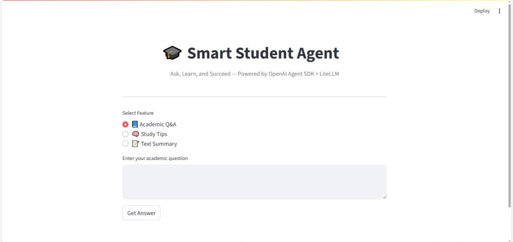

# 📚 MySmartStudyAI

An intelligent AI-powered study assistant built with **Python + OpenAI Agent SDK** to help students learn, revise, and summarize academic content — quickly and clearly.  

🔗 **Live Demo:** [Try MySmartStudyAI](https://mysmartstudyai.streamlit.app/)  
🐙 **GitHub Repo:** [MySmartStudyAI](https://github.com/tejasjundre/MySmartStudyAI)

---

## 💡 What It Does

Ask your academic question or paste a passage — get **clear, concise, and actionable answers**.

✅ Answer academic questions  
✅ Provide personalized study tips  
✅ Summarize long text into key points  
✅ Modern, responsive & interactive UI  

---

## ✨ Features

- 💻 Built with **Python + Streamlit**  
- 🧠 Powered by **OpenRouter (LiteLLM models)**  
- 🎨 Clean, animated & professional UI  
- 🔐 Secure API key handling via `.env`  

---

## 🖼️ Preview



---

## 📁 Folder Structure

📦 MySmartStudyAI
┣ 📄 app.py → Frontend (Streamlit UI)
┣ 📄 main.py → Core AI agent logic
┣ 📄 requirements.txt
┣ 📄 .env → API key config (keep secret)


---

## 🧑‍💻 Ideal For

- Students preparing for exams or assignments  
- Teachers & educators showcasing AI in classrooms  
- Developers exploring **AI + Streamlit** projects  
- Recruiters reviewing practical AI applications  

---

## 🔐 Tech Stack

- Python 3.10+  
- Streamlit  
- OpenAI Agent SDK  
- LiteLLM + OpenRouter (free AI models)  

---

## 🚀 Deployment

1. Clone this repo:  
   ```bash
   git clone https://github.com/tejasjundre/MySmartStudyAI.git
   cd MySmartStudyAI
