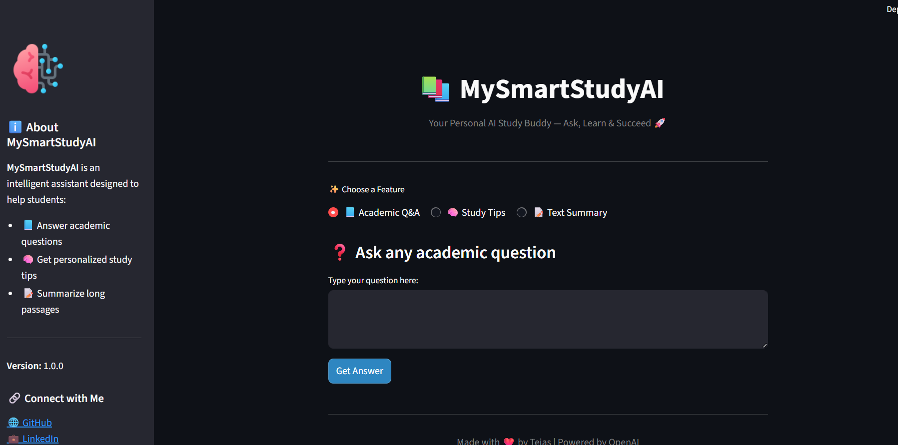

# 📚 MySmartStudyAI


**MySmartStudyAI** is an **AI-powered study assistant** built with **Python + Streamlit**, designed to help students **learn, revise, and summarize academic content** with clarity and speed.  

🔗 **Live Demo:** [Try MySmartStudyAI](https://smart-student-agent-f3cdjedejrtzdidu3mj5ux.streamlit.app/)  
🐙 **GitHub Repo:** [MySmartStudyAI](https://github.com/tejasjundre/MySmartStudyAI)

---

## 🚀 Overview

With MySmartStudyAI, students can:  
- ❓ **Ask academic questions** and get instant, simplified answers  
- 🧠 **Receive personalized study tips** tailored to their topics  
- 📝 **Summarize long passages** into short, clear key points  

👉 Built with a **clean UI**, **animated interface**, and **secure API integration**, this project demonstrates practical application of **AI + Streamlit** for educational use cases.  

---

## ✨ Features

- 💻 **Streamlit frontend** with modern & responsive design  
- 🧠 **OpenRouter models** via `openai` Async API  
- 🔐 **Environment-based API key management** (`.env` + Streamlit Secrets)  
- 🎨 **Animated UI** with styled response boxes and sidebar info  
- ⚡ Ready for **deployment on Streamlit Cloud**  

---

## 📂 Project Structure


MySmartStudyAI/
├── app.py             # Streamlit frontend
├── main.py            # Core AI logic (Q&A, Tips, Summarizer)
├── requirements.txt   # Project dependencies
├── .env               # API key (ignored in Git)
├── images/            # Screenshots & preview assets
└── README.md          # Project documentation


## 🖼️ Preview




---

## 🧑‍💻 Tech Stack

- **Language:** Python 3.10+  
- **Framework:** Streamlit  
- **AI API:** OpenRouter models via OpenAI SDK  
- **Styling:** Custom CSS animations + Streamlit widgets  
- **Deployment:** Streamlit Cloud  

---

## 🛠️ Installation & Setup

1. **Clone the repository**  
   ```bash
   git clone https://github.com/tejasjundre/MySmartStudyAI.git
   cd MySmartStudyAI

---

## 🧑‍🏫 Ideal Users

- 🎓 Students preparing for exams or assignments  
- 👩‍🏫 Teachers demonstrating AI in education  
- 💼 Recruiters evaluating AI + Python projects  
- 👨‍💻 Developers learning **Streamlit + AI integration**  

---

